# End-2-End Supervised Domain Adaptation

## Architecture
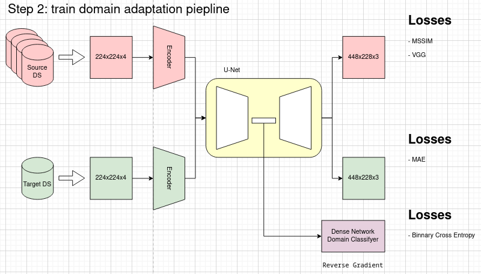

## Experiments

### Data

| Dataset             | Number of crops / images | Camera         |
| ------------------- | ------------------------ | -------------- |
| Zurich Raw2Rgb      | 46839                    | Sony IMX380    |
| MAI 2021            | 24161                    | Sony IMX586    |
| Samsung S7          |                          | Samsung S5K2L1 |
| Google Pixel (ours) |                          |                |

### Results of Domain Adaptation

- Source Domain - Zurich Raw2Rgb

| Target Dataset      | 10% of images (pasr/ssim) (~80 images) | 10 images    | 5 images     | 1 image      |
| ------------------- | -------------------------------------- | ------------ | ------------ | ------------ |
| MAI 2021            | 23.192/0.867                           | 23.145/0.860 | 21.713/0.790 | 19.082/0.775 |
| Samsung S7          | 22.307/0.821                           | 21.954/0.813 | 20.731/0.781 | 18.825/0.766 |
| Google Pixel (ours) |                                        |              |              |              |

- Source Domain - MAI 2021

| Target Dataset      | 10% of images (pasr/ssim) (~80 images) | 10 images | 5 images | 1 image |
| ------------------- | -------------------------------------- | --------- | -------- | ------- |
| Zurich Raw2Rgb      | 20.501/0.797                           |           |          |         |
| Samsung S7          | 22.942/0.846                           |           |          |         |
| Google Pixel (ours) |                                        |           |          |         |

- Source Domain - Samsung S7

| Target Dataset      | 10% of images (pasr/ssim) | 10 images | 5 images | 1 image |
| ------------------- | ------------------------- | --------- | -------- | ------- |
| Zurich Raw2Rgb      | 19.619/0.763              |           |          |         |
| MAI 2021            | 22.830/0.851              |           |          |         |
| Google Pixel (ours) |                           |           |          |         |

### Results of Transfer Learning

- Source Domain - Zurich Raw2Rgb

| Target Dataset      | 10% of images (pasr/ssim) |
| ------------------- | ------------------------- |
| MAI 2021            | 22.614/0.826              |
| Samsung S7          | 19.017/0.793              |
| Google Pixel (ours) |                           |

## Examples

- [Zurich -> MAI] Domain adaptation vs transfer learning

| Domain Adaptation                      | Transfer Learning                      | Ground Trough                          |
| -------------------------------------- | -------------------------------------- | -------------------------------------- |
| 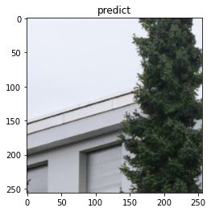 | 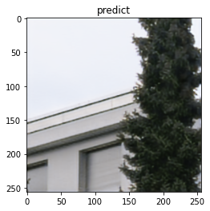 | 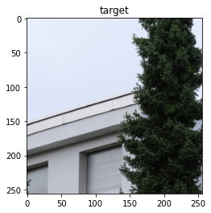 |
| 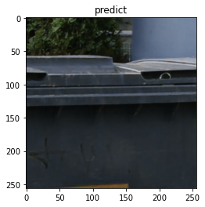 | 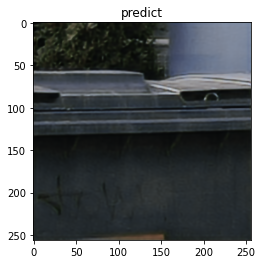 | 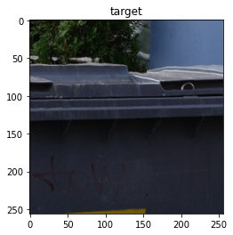 |
| 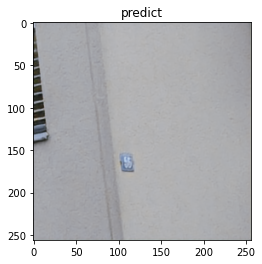 | 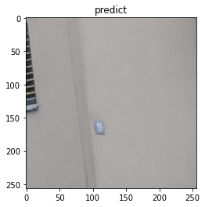 | 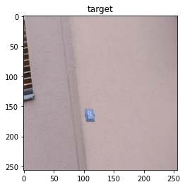 |
| 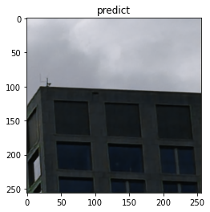 | 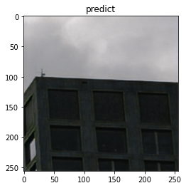 | 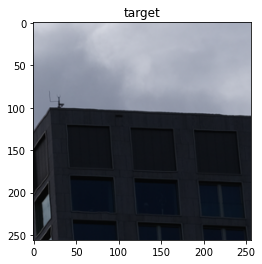 |
| 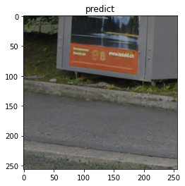 | 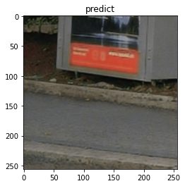 | 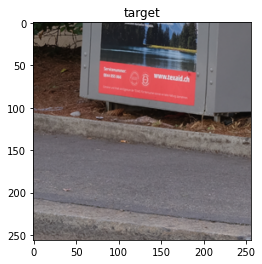 |
| 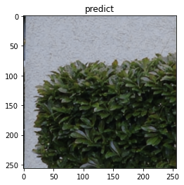 | 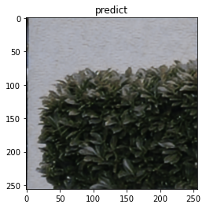 |  |

- [Zurich -> MAI] Domain adaptation 1 image vs 10

| 10 images                              | 5 images                              | 1 image                               | Ground Trough                          |
| -------------------------------------- | ------------------------------------- | ------------------------------------- | -------------------------------------- |
|  | 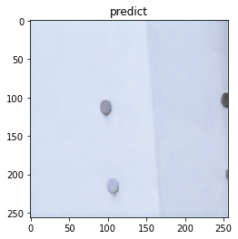 |  |  |
|  | 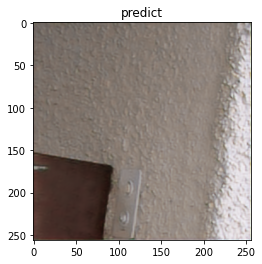 | 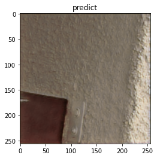 |  |
|  |  |  |  |
|  | 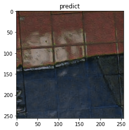 |  |  |
|  |  | 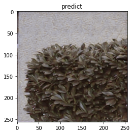 | 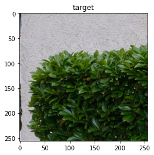 |

